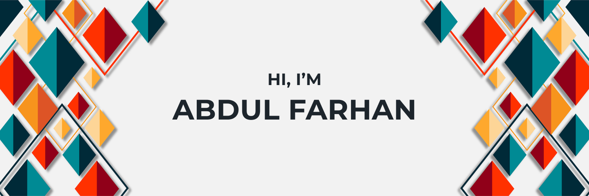

Hey there,

I'm Abdul, a full-stack Web Developer based in Vancouver BC, Who is passionate about building user-friendly, easy-to-use single page applications, that makes a difference to the lives of those around me. I like to explore new trends and learn new technologies. I'm Currently learning Next.js, and looking to collaborate on Open-Source projects, with a goal to be more involved in the Development Community. I'm also open to having a chat about **Anything Web Development Related**.

Want to know more about me? [Check out my portfolio](https://www.abdulfarhan.com)

## Current Skills

#### Preprocessor Scripting Language

#### Programming Languages

#### Frameworks, Platforms and Libraries

#### Databases

#### Hosting

#### Design

## Current Stats

